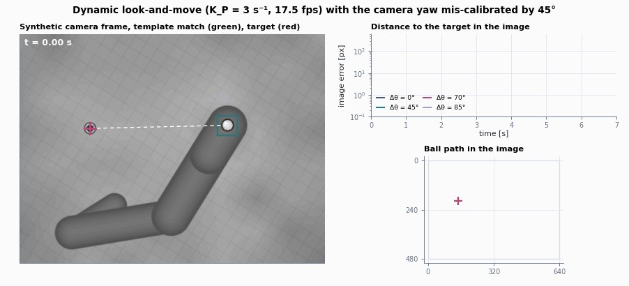
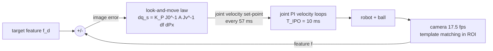
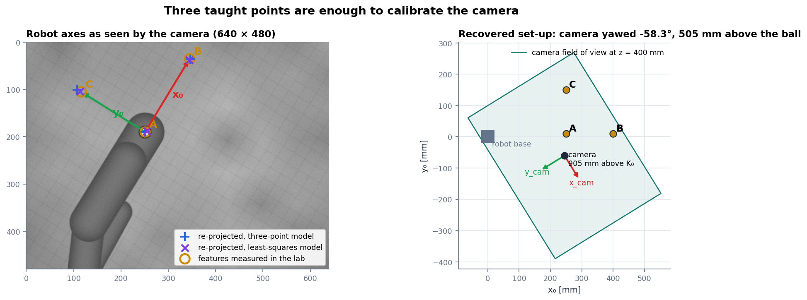
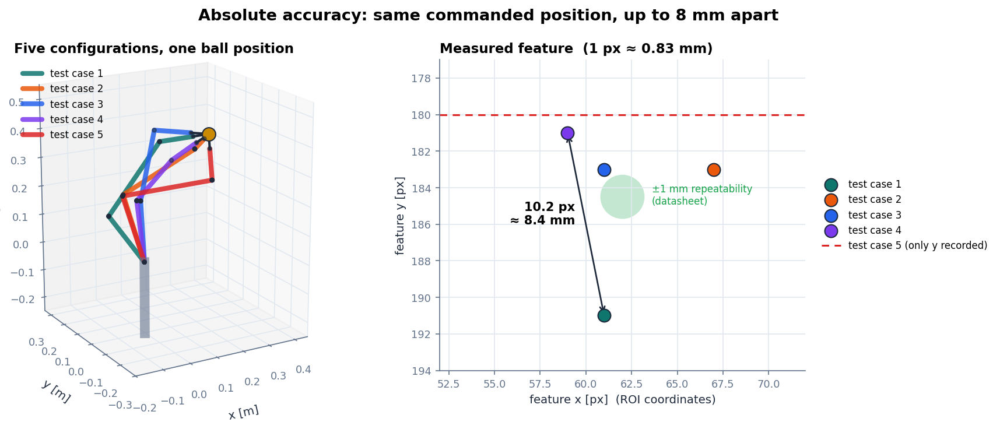
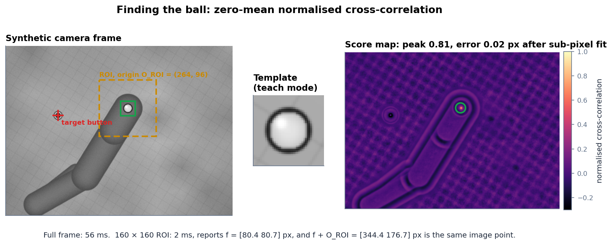
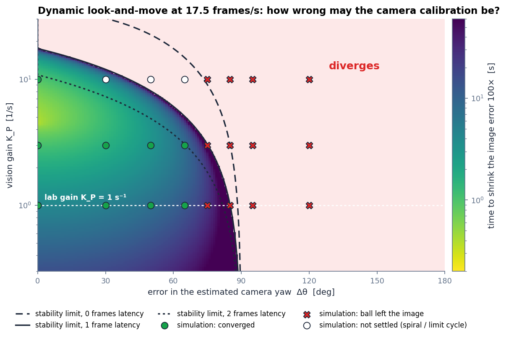

<div align="center">

# look-and-move

**Image-based visual servoing of a 6-DoF arm with one overhead camera: pinhole model, template matching, three-point
hand-eye calibration, and a stability map that explains why a badly calibrated camera still works.**

[](../../actions/workflows/ci.yml)




</div>

This project started as a university lab on visual servoing: an igus ReBeL 6-DoF arm with a ball on its tool, a Raspberry Pi
HQ camera looking down at the workspace, OpenCV template matching and a dynamic look-and-move controller. This repository
rebuilds that loop end to end in Python, so it runs anywhere without the hardware. The robot model, the camera and its
calibration come from the lab's own measurements. It then answers the lab's open questions with numbers instead of guesses.

## Highlights

| | |
| --- | --- |
| **Validated robot model** | DH model of the ReBeL with the 60 mm ball tool. All five lab test configurations put the ball at exactly (250, 10, 400) mm. |
| **A camera you can render** | Pinhole camera with the lab's optics (6 mm lens, 9.82 µm effective pixels, 640 × 480) and a synthetic renderer for table, target, arm and ball. |
| **Template matching from scratch** | FFT-based zero-mean NCC with integral images and a sub-pixel peak: 0.02 px error. A 160 × 160 adaptive ROI is about 20× faster than the full frame. |
| **Calibration from three taught points** | Camera yaw −58.3°, 0.83 mm/px, 505 mm above the ball, camera at (245, −60, 905) mm, all from the lab's three measured features. |
| **Absolute accuracy** | One commanded position, five joint configurations, up to 8.4 mm apart in the image. The datasheet repeatability is ±1 mm. |
| **Closed-form robustness** | $e_{k+1} = e_k - g\,e^{i\Delta\theta}e_{k-d}$ predicts the largest tolerable camera-yaw error: 85° at the lab gain, confirmed in closed-loop simulation. |

## Quick start

```bash
# from the repository root
python -m pip install -e ".[dev]"
python examples/quickstart.py      # prints the numbers below
pytest                             # 48 tests
python examples/make_figures.py    # regenerates everything in docs/media
```

```python
import numpy as np
from lookandmove import IdealMeasurement, PinholeCamera, ReBeL, ServoConfig, calibrate_three_points, lab, simulate

robot = ReBeL()
cal = calibrate_three_points(lab.F_A, lab.F_B, lab.F_C, lab.P_A, lab.P_B, lab.P_C)
camera = cal.camera()  # the camera identified from the lab data
belief = PinholeCamera.looking_down(camera.position, cal.yaw + np.deg2rad(45))  # a 45 deg calibration error

q0 = np.deg2rad(lab.TEST_CASES_DEG[0])
target = camera.project([0.20, 0.08, 0.40])
result = simulate(robot, q0, target, belief, IdealMeasurement(camera), ServoConfig(gain=1.0, duration=12))
print(result.converged, result.settling_time())
```

<details>
<summary>Output of <code>examples/quickstart.py</code></summary>

```text
reduced pixel size: 9.82 um
ball centre of the five test cases [mm]:
    [250.  10. 400.]
    [250.  10. 400.]
    [250.  10. 400.]
    [250.  10. 400.]
    [250.  10. 400.]
camera yaw -58.3 deg, 0.8275 mm/px, depth 505.4 mm
camera position [244.8 -60.3 905.4] mm
K_P = 1, yaw error  0 deg: settled in 5.8 s
K_P = 1, yaw error 45 deg: settled in 10.1 s
K_P = 1, yaw error 85 deg: lost the ball
analytic limit for K_P = 1: 85.1 deg
```
</details>

## The loop



The camera loop runs about 6× slower than the robot's interpolation cycle. In this *dynamic look-and-move* structure the
vision controller only hands out velocity set-points, and the robot's own joint loops do the fast work. The simulator
models every block: frame rate, one frame of processing latency, first-order joint velocity loops, joint speed limits,
pixel noise and loss of tracking when the ball leaves the image.

## Results

### 1. Calibrating the camera from three taught points



In the lab the ball was driven to $P_A = (250, 10, 400)$ mm, then 150 mm along $x_0$ ($P_B$) and 140 mm along $y_0$ ($P_C$).
The three features fix everything:

| quantity | three-point method (lab) | least squares (all 3 points) |
| --- | :-: | :-: |
| camera yaw about the vertical | −58.3° | −59.2° |
| image scale on the working plane | 0.8275 mm/px | 0.8536 mm/px |
| depth $c_z$ (pinhole → ball plane) | 505.4 mm | 521.4 mm |
| camera position $p_{0,cam}$ | (244.8, −60.3, 905.4) mm | (240.9, −60.8, 921.4) mm |
| worst re-projection error | 9.8 px (point C) | 3.7 px |

The measurement carries its own error estimate. The $x$ step reads 0.8275 mm/px, the $y$ step 0.8776 mm/px (6 % apart), and
the two image axes are 89.0° apart instead of 90°. That inconsistency is the robot's absolute positioning error showing up
in the image. The least-squares fit spreads it over all three points.

### 2. Same command, different pose: what the camera says about accuracy



The five test configurations from the preparation reach the same ball position with different wrist orientations. The model
confirms this to 0.04 mm. On the real robot the camera saw the ball up to **10.2 px ≈ 8.4 mm** apart, so the absolute
accuracy is several millimetres, far coarser than the ±1 mm repeatability on the datasheet. Repeatability compares a pose
with itself. Accuracy compares different joint paths to the same nominal point and exposes every error in the kinematic model.

### 3. Finding the ball



`match_template` computes the zero-mean normalised cross-correlation for every offset (FFT for the correlation, integral
images for the local means and variances), then fits a parabola through the peak. On rendered frames with noise the ball
is located to about 0.02 px. Restricting the search to a 160 × 160 ROI around the last detection makes each frame about 20×
cheaper. The ROI also explains the lab's question about changing the ROI: the reported feature is relative to the ROI origin,
$f^{(img)} = f + O_{ROI}$.

### 4. How wrong may the calibration be?



With the fast inner loop, one camera period moves the feature by $g\,R(\Delta\theta)\,e$, where $\Delta\theta$ is the error in
the believed camera yaw and $g = K_P T$. As a complex number the image error obeys

$$
e_{k+1} = e_k - g\,e^{i\Delta\theta}\,e_{k-d}
$$

with $d$ frames of latency ([derivation](docs/theory.md#6-stability-under-calibration-errors)). Without latency the loop
converges if and only if $g < 2\cos\Delta\theta$, so a slow controller tolerates almost any yaw error below 90°. The map shows the
convergence time and the stability limits for 0, 1 and 2 frames of latency; markers are full closed-loop simulations.

| $K_P$ [1/s] | analytic yaw-error limit (1 frame latency) | simulation |
| :-: | :-: | --- |
| 1 (lab) | 85.1° | converges up to 70° (in 24 s); from 75° the spiral carries the ball out of the image |
| 3 | 75.2° | converges up to 60°, still spiralling at 65–70° |
| 10 | 40.2° | at 30° it already circles the target in a ~9 px limit cycle: the 30 ms velocity loop adds about half a frame of lag |

A wrong depth or pixel size only rescales $g$. It changes the speed, not whether the loop converges.

### 5. The animation

The GIF at the top runs the complete pipeline (rendering, template matching, look-and-move law, joint velocity loops) with a
45° yaw error and $K_P = 3\ \text{s}^{-1}$. The ball reaches the target on a curve, 6.7 s after the start instead of 3.1 s. The
right-hand panels add 0°, 70° and 85°: straight, spiralling, and lost.

## The lab questions, answered

| question | answer |
| --- | --- |
| Why capture at 640 × 480 instead of 4056 × 3040? | 40× fewer pixels to correlate. Template matching cost grows with the image area, and the reduced size is what keeps the camera loop at 15–20 frames per second. |
| Effective pixel size at 640 × 480? | $1.55\ \mu\text{m}\cdot 4056/640 = 9.82\ \mu\text{m}$. |
| Is a perfectly calibrated camera required? | No. Any yaw error below the limit in the table above converges (85° at the lab gain). Calibration errors cost speed and a curved path, not the final accuracy in the image. |
| What does changing the ROI do? | It shifts the reported feature by the ROI origin. The image position $f + O_{ROI}$ stays the same, and a smaller ROI is much faster. |
| Why is a P controller sufficient? | The joint velocity loops make the robot an integrator from set-point to position, so the outer loop already removes any constant error. |
| What happens when the camera is rotated? | The ball spirals into the target, more slowly, by $\cos\Delta\theta$. Beyond ~85° it spirals outwards, and in practice it leaves the image from about 75°. |

## Repository layout

```text
look-and-move/
├── src/lookandmove/
│   ├── robot.py         # ReBeL DH model, Jacobian, numerical IK, Euler angles
│   ├── camera.py        # pinhole camera, projection, image Jacobian
│   ├── render.py        # synthetic frames: table grid, target, arm, ball
│   ├── vision.py        # FFT normalised cross-correlation, ROI, sub-pixel peak
│   ├── calibration.py   # three-point and least-squares hand-eye calibration
│   ├── servo.py         # dynamic look-and-move simulator
│   ├── stability.py     # closed-form stability analysis
│   └── lab.py           # poses and image features measured in the lab
├── tests/               # 48 pytest cases
├── examples/            # one script per figure + quickstart
├── docs/theory.md       # derivations
├── docs/media/          # generated figures and animation
└── matlab/              # original lab scripts (MATLAB)
```

## Background

[docs/theory.md](docs/theory.md) collects the pinhole model, the image Jacobian, the look-and-move law, both calibration
methods and the stability derivation. [`matlab/`](matlab) keeps the original MATLAB preparation scripts.

## License

[MIT](LICENSE)
